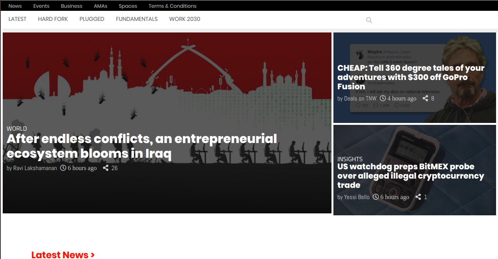

# The-next-web
### [Live link](https://fatymahmed.github.io/The-next-web/)

- This Project consists of replicating [the next web webpage](https://thenextweb.com/).
- The emphasis is how the webpage behaves differently depending on the size of the screen where the website is rendered.

## Built With

### Technologies Used:
- HTML
- CSS

## Authors
👤 **Author1**
- Adebola Adeniran  [https://github.com/onedebos/]

👤 **Author2**
- Fatima Ahmed [http://github.com/fatymahmed]

To get a local copy up and running follow these simple example steps.

- Clone the project with the following command.
    `git clone git@github.com:fatymahmed/The-next-web.git`
## 📝 License

This project is [MIT](lic.url) licensed.
